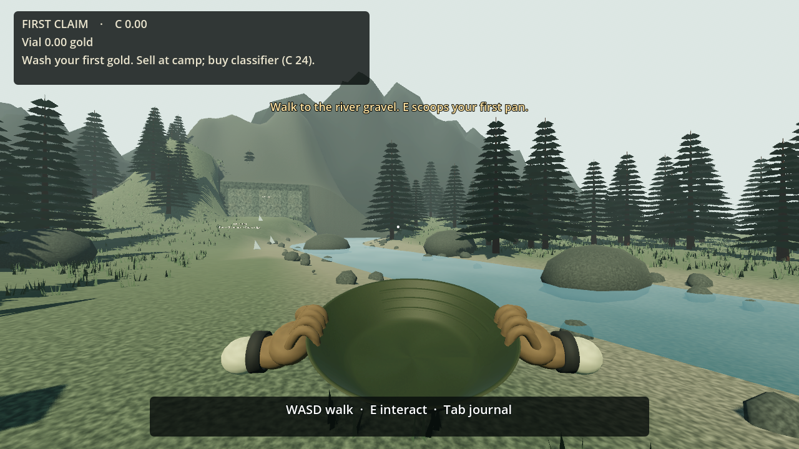
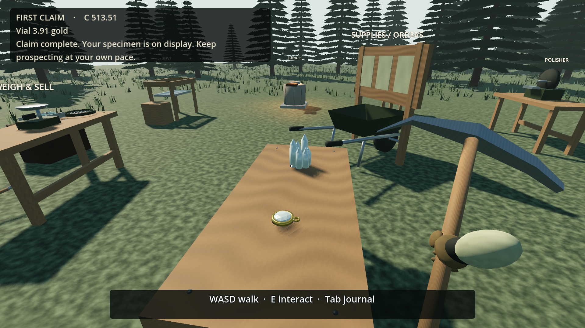

# First Claim

**One prompt started a mining game. Let's see what we can build together.**

First Claim is a small, single-player 3D mining-game experiment built with AI assistance in Godot. Start with a gold pan beside a river, earn better equipment, follow a detector toward the mountain, excavate a mine, and turn recovered materials into a final gold-and-quartz commission.

This is a playable prototype, with rough edges and room for your ideas. What would you change to make it better?

## Play from source

1. Install [Godot 4.5.2](https://github.com/godotengine/godot/releases/tag/4.5.2-stable), the version used for this build.
2. Clone this repository or download its source ZIP.
3. In Godot, choose **Import**, select `project.godot`, and wait for assets to import.
4. Press **F6** with `source/main.tscn` open, or **F5** to run the project. Choose **Start a new claim**.

No Blender installation is needed to play. The exported `.glb` models and textures are included. Editable Blender sources and procedural generators are available if you want to change the assets.

The game works offline, with no login, payments, telemetry or runtime services. The renderer uses Godot's Mobile rendering mode; this name does not imply tested phone support. Desktop keyboard and mouse are required.

## The first scoop

Walk to the gravel beside the river and press **E** to scoop. Press **E** near water to fill the pan. Alternate **Q/R** to loosen the sediment and hold **F** to wash. Collect the exposed gold with **E**, sell it at camp, and buy the classifier before the detector.

| Control | Action |
| --- | --- |
| WASD / mouse | Walk / look |
| Shift | Move faster |
| E | Interact, collect, confirm a frame, clear rubble |
| Q / R / F | Swirl left / right / wash |
| 1 / 2 / 3 | Pan / detector / pick |
| Left click | Excavate the rock under the reticle |
| B / H | Preview a support frame / fit roof lagging |
| X, then X | Confirm removal of a support |
| 4 / T | Attach or park the wheelbarrow / transfer material |
| Tab / Escape | Journal / pause |

Settings include simple panning, reduced motion, mouse sensitivity, volume controls, graphics quality and resolution. Save from the pause menu or journal; autosaves also run during play. A new claim preserves the previous campaign as a backup.

## Build something cool with us

Fork the repo, try an idea, and open a pull request. You can also [report a bug or propose an improvement](https://github.com/everyoneneedsasamwise/first-claim/issues).

Useful places to start:

- Make the first five minutes easier to understand.
- Improve the feel of panning, digging and hauling.
- Make the world and tools more readable and interesting.
- Add accessibility options or test another platform.
- Expand the progression with a focused new recipe, tool or commission.

See [CONTRIBUTING.md](CONTRIBUTING.md) for setup and checks. Small, focused changes with a screenshot or short recording are especially helpful. Suggestions and contributions are welcome; a pull request still needs review before it becomes part of the main game.

## What has been tested

A guided automated run completed the river, detector, excavation, workshop and final commission using ordinary inputs, then continued playing and reloaded the completed claim. Separate checks cover resource accounting, support rules and save persistence. A standalone macOS package was also launched and tested locally.

Those tests establish connected systems and saved progress. They do **not** establish first-time usability, long-term enjoyment or a human campaign length. Windows was exported during development but has not been executed on Windows. No Linux playtest has been completed. See [KNOWN-ISSUES.md](KNOWN-ISSUES.md).

## Project layout

- `source/` — Godot game code, scene and guided QA controllers.
- `assets/` — game models, textures, synthetic audio and editable Blender sources.
- `tests/` — accounting, identity, persistence and support checks.
- `tools/` — local launch/check helpers and deterministic asset generators.
- `asset-manifest.json`, `asset-groups.json` — asset inventory and provenance.

The original build used a prepared implementation prompt after design planning. The agent tested and repaired its own work. “One prompt” describes that initial build instruction, not a claim that a finished game appeared without testing or iteration. Documentary footage, presenter recordings, private production logs and external reference images are excluded from this repository.

## License

Original project code and assets are available under the [MIT License](LICENSE). Godot and its dependencies retain their own notices in [GODOT-NOTICES.txt](GODOT-NOTICES.txt). See [LICENSES.md](LICENSES.md) for provenance.
